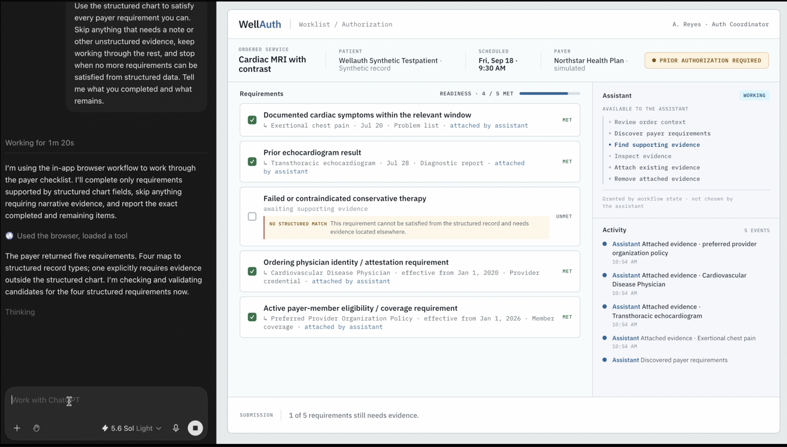
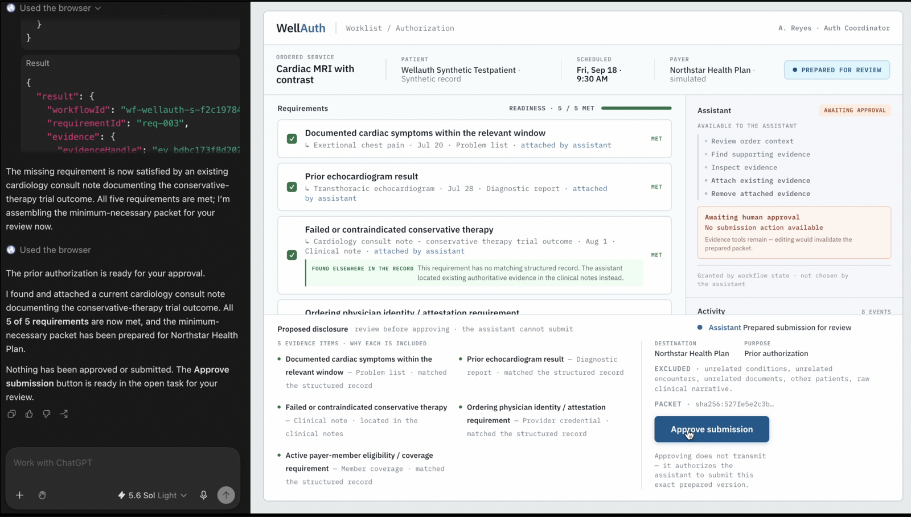

# WellAuth

WellAuth is a WebMCP-enabled prior-authorization application: a cardiac MRI is
already ordered and blocked on prior authorization, and a browser agent uses
WellAuth's state-specific capabilities to discover the payer's five
requirements, locate existing authoritative evidence in the FHIR record, attach
it to exact requirements, and prepare the exact proposed disclosure — then
**stops**, because it has no capability to submit until a human approves.

> The healthcare application exposes exactly the capabilities an agent may use
> at each workflow state, while authoritative clinical truth, workflow policy,
> and human submission authority remain outside the model.

**Live demo:** <https://wellauth-provider-qxqdngmwjq-uc.a.run.app>

---

Both screenshots below are a real ChatGPT agent, in the **GPT Work App**, driving
WellAuth through its WebMCP capabilities. The agent panel is on the left; the
WellAuth page it is operating is on the right.



*The agent was told to satisfy every requirement it could from the structured chart and
to stop when no more could be. It reached **4 / 5** and stopped. The fifth requirement
reads `NO STRUCTURED MATCH` — the agent reports what remains instead of manufacturing
evidence. Its inventory holds evidence tools only: there is no capability to submit.*



*The fifth requirement satisfied from a cardiology consult note found elsewhere in the
authorized record — **5 / 5**, bound to packet `sha256:527fe5e2c3b…`. The agent states
plainly: "Nothing has been approved or submitted." The assistant panel reads **Awaiting
human approval · No submission action available**. `Approve submission` is a human
control in WellAuth, and approving it authorizes — it does not transmit.*

---

## How it works

**Discover.** A cardiac MRI with contrast is already ordered and scheduled.
The agent reads the order through a bounded capability — it cannot query FHIR
freely — and discovers the payer's five requirements. WellAuth never changes
the ordered service or authors clinical facts.

**Locate and attach.** The agent searches the authorized record for *existing*
evidence and attaches exact resource versions to exact requirements. Four
requirements match structured data. The fifth does not, and the agent says so
rather than inventing it; the evidence is found in a clinical note through a
different bounded search path. Attachment is workflow bookkeeping — it does not
touch the medical record and does not disclose anything to the payer.

**Prepare, then stop.** At 5 of 5 the agent prepares the exact proposed
disclosure and freezes it to a packet hash. It now has **no capability to
submit**. A workforce user reviews the disclosure and clicks **Approve
submission** — a human control in the page, never a WebMCP tool, bound
server-side to that exact revision and hash.

**Submit and reconcile.** Only after approval does
`submit_prior_authorization` appear in the browser's tool inventory. The agent
submits exactly once to a separate, clearly labelled simulated payer. The payer
approves — but with a validity window ending before the scheduled MRI, so
WellAuth unlocks **Resolve authorization window**, repeats the same human gate
for the extension, and ends at `AUTHORIZATION_ALIGNED` with the MRI covered.

---

## Run it

**Fastest — the deployed app.** No account, no setup, no terminal:

<https://wellauth-provider-qxqdngmwjq-uc.a.run.app>

You should land on the authorization workspace: **Cardiac MRI with contrast**,
scheduled **September 18, 9:30 AM**, payer **Northstar Health Plan**, status
**Prior authorization required**.

Every browser tab mints its own workflow, so you always start clean, a reload
preserves your run, and you cannot collide with anyone else. Nothing to reset.

### Point an agent at it

Use the **GPT Work App** (the client in the screenshots above), ChatGPT
Desktop's browser/site-tools capability, or a Chrome build with native WebMCP —
where you can watch the inventory live in **DevTools → Application → WebMCP**.
The page ships `@mcp-b/webmcp-polyfill`, which defers to a native implementation
when one is present. Desktop, optimized for **1600 × 900**.

Then give it the goal:

> Get this MRI ready for prior authorization using the evidence already
> available. Do not create or infer missing clinical evidence, and do not submit
> anything unless the workflow is complete and a human has approved it. Stop
> when human approval is required.

The agent inspects the order, discovers the five requirements, attaches
evidence, reaches 4 of 5, locates the fifth through a different bounded search
path, prepares the submission — and stops. The page changes at every step.

**Then click `Approve submission`.** `submit_prior_authorization` appears in the
browser's tool inventory without a reload. That unlock is the whole product. If
your client needs a nudge to continue: *"Continue now that I have approved the
submission."*

**Act II.** The simulated payer approves, but the authorization ends September
12 and the MRI is September 18. A new capability, **Resolve authorization
window**, appears. Let the agent prepare the extension, click **Approve
extension request**, and let it submit. The workflow ends with the MRI covered.

### Try to break it

- Ask the agent to submit before you approve — the tool does not exist, and the
  route underneath refuses with `APPROVAL_REQUIRED`.
- Ask it to change the ordered service or write a missing diagnosis — no such
  capability exists.
- Reload at any point — page and tool inventory rebuild from the backend.

---

## Run locally

Local runs use the **same** Google Cloud FHIR store and Firestore databases as
the deployed service; there is no offline mode. You need Google Cloud access to
the project for anything past the unit tests.

### Prerequisites

- Node.js 20+ and npm (verified on Node 25.2.1, npm 11.6.2).
- For the unit suites only: nothing else.
- For a running app: `gcloud` with application-default credentials for a
  principal that can read the `wellauth` Healthcare dataset and read/write the
  `wellauth-workflow` Firestore database.

```bash
git clone https://github.com/markbrazinski/wellauth.git
cd wellauth
npm install
```

Unit tests need no cloud access and are the fastest proof the logic is intact:

```bash
npm test          # 127/127
```

### Start the stack

Terminal 1 — the provider API (defaults to `:8080`):

```bash
gcloud auth application-default login
PAYER_BASE_URL=https://wellauth-payer-simulator-qxqdngmwjq-uc.a.run.app \
  node provider/index.js
```

Terminal 2 — the UI, pointed at that provider:

```bash
VITE_API_BASE=http://localhost:8080 npm run dev
```

Open <http://localhost:5173>, then drive it exactly as above.

### Expected health checks

```bash
curl -fsS http://localhost:8080/health
curl -fsS http://localhost:8080/workflows/wf-wellauth-001/snapshot
```

`/health` should report `"storeReachable": true` and `"fhirVersion": "4.0.1"`.
The snapshot returns the canonical workflow's server-authoritative state — the
UI renders this and never computes state itself.

Environment variables worth knowing: `PORT`, `GCP_PROJECT`, `FHIR_DATASET`,
`FHIR_STORE`, `FIRESTORE_DATABASE`, `PAYER_BASE_URL`. All have working defaults
except `PAYER_BASE_URL`, without which submission is disabled.

### Shutdown

Ctrl-C both terminals. Nothing is left running and no local state persists —
workflow truth lives in Firestore.

---

## Architecture

```text
Human ──approval controls──┐
                           ▼
                  WellAuth React UI
                           │  native WebMCP (document.modelContext)
                           ▼
                    Browser agent
                           │  bounded domain operations
                           ▼
              wellauth-provider (Cloud Run)      ← serves the UI, same origin
                 ├── Cloud Healthcare API / FHIR R4   clinical source truth
                 ├── Firestore wellauth-workflow      workflow authority
                 └── authenticated submission (ID token)
                           ▼
          wellauth-payer-simulator (Cloud Run)   ← separate service + identity
                 └── Firestore wellauth-payer         payer truth
```

The UI is served **by the provider itself**, so the page, the agent, and the
workflow API share one origin: no CORS, no cross-origin cookie or WebMCP
complexity, and one URL for a judge. The payer boundary stays real — separate
service, separate service account, separate Firestore database, authenticated
with a Cloud Run ID token.

### Where truth lives

| Concern | Owner |
|---|---|
| Clinical facts | Cloud Healthcare FHIR R4 (provider identity is **read-only**) |
| Workflow state, approvals, hashes | Firestore, transactional |
| What the agent may do now | Provider capability document |
| Payer decisions and validity | The payer simulator's own database |
| Anything at all | **Never** React |

---

## WebMCP implementation

Entry point is `document.modelContext`. Tools are registered imperatively;
removal is via the `AbortSignal` passed at registration — there is no
`unregisterTool`. `execute` returns plain structured JSON.

The frontend never decides which tools exist. It synchronizes registrations
from the server's `availableTools`, so the browser's inventory and the backend's
state cannot drift.

### The eleven tools

| Tool | What it does | Effect |
|---|---|---|
| `get_order_context` | Return the ordered service, scheduled date, payer, and whether prior authorization is required | read-only |
| `discover_coverage_requirements` | Discover the payer's coverage requirements and record them against the workflow | mutates workflow |
| `find_supporting_evidence` | Search the authorized clinical record for existing evidence that may satisfy one requirement | read-only |
| `inspect_evidence` | Return the detail of one candidate evidence record by opaque handle | read-only |
| `attach_evidence` | Attach a reference to an existing authoritative record so it satisfies one requirement | mutates workflow · reversible |
| `remove_evidence` | Detach the evidence reference currently satisfying one requirement | mutates workflow · reversible |
| `prepare_prior_authorization` | Assemble the minimum-necessary packet from attached evidence and freeze it for human review | mutates workflow · does not submit |
| `submit_prior_authorization` | Transmit the human-approved request to the payer | **transmits** · exactly once |
| `check_authorization_status` | Return the payer decision and whether it covers the scheduled service date | read-only |
| `resolve_authorization_window` | Prepare a bounded request to align the authorization validity window with the scheduled date | mutates workflow · does not transmit |
| `submit_authorization_extension` | Transmit the workforce-approved window extension to the payer | **transmits** · exactly once |

No tool alters the source medical record, creates clinical information, or
approves a submission. `attach_evidence` and `remove_evidence` are workflow
bookkeeping — they record which existing record supports which requirement.
Both approvals are workforce-gated HTTP routes, never WebMCP tools.

Agent-facing descriptions and input schemas live in
[`src/capabilities.ts`](src/capabilities.ts); user-facing labels are mapped in
[the integration contract](docs/final-ui/INTEGRATION-CONTRACT.md).

### Capability lifecycle

| State | Browser-visible tools |
|---|---|
| `CONTEXT_READY` | `get_order_context`, `discover_coverage_requirements` |
| `REQUIREMENTS_RESOLVED` | + `find_supporting_evidence`, `inspect_evidence`, `attach_evidence`, `remove_evidence` |
| `PACKET_COMPLETE` | + `prepare_prior_authorization` |
| `PREPARED_AWAITING_APPROVAL` | **no submission capability** |
| `APPROVED` | + `submit_prior_authorization` |
| submitted | − submit, + `check_authorization_status` |
| `PAYER_APPROVED_COVERAGE_GAP` | + `resolve_authorization_window` |
| `REMEDIATION_PREPARED` | **no submission capability** |
| `REMEDIATION_APPROVED` | + `submit_authorization_extension` |
| `AUTHORIZATION_ALIGNED` | status/read only |

**A capability being absent is an affordance and an agent-safety signal, not a
security boundary.** Every route independently re-validates state, revision,
freshness, and authority. Both human approvals are workforce-gated HTTP routes
and are deliberately never WebMCP tools.

---

## Test evidence

```sh
npm test                                                     # 127/127 unit
npm run test:gate2                                           # 147/147 workflow
PAYER_BASE_URL=<payer> npm run test:gate3                    # 191/191 submission
PAYER_BASE_URL=<payer> npm run test:gate4                    # 99/99   integrated
npm run test:gate5                                           # 41/41   sessions
GATE4_BASE_URL=<provider> PAYER_BASE_URL=<payer> \
  npm run test:gate4                                         # 99/99   deployed
npm run test:browser                                         # 12/12   real browser
node browser-journey.mjs <provider>                          # 107/107 full journey
```

`test:gate5` proves judge-session determinism and read-only non-mutation: a
fresh session starts at `CONTEXT_READY`, sessions are isolated, a reload
preserves state byte-for-byte, and every read-only tool leaves state, revision,
bindings, approvals and payer posture unchanged.

`browser-journey.mjs` drives the **complete Act I + Act II journey** in a real
anonymous browser with no reload, asserting after every capability transition
that the browser's own WebMCP inventory equals `snapshot.availableTools` — plus
both human gates, exactly-once submission, and final cross-surface agreement.

---

## Standards claims

WellAuth **uses FHIR R4 (4.0.1)** resources. Requirement discovery is
**informed by Da Vinci CRD concepts**; documentation assembly is
**DTR-inspired**; the outgoing artifact is a **PAS-shaped** FHIR R4
prior-authorization request that satisfies the cardinality and fixed-value
constraints of the PAS 2.2.1 `profile-claim` and `profile-pas-request-bundle`,
verified against the official package (`docs/GATE-3-PAS-VALIDATION.md`).

WellAuth does **not** claim: PAS/CRD/DTR conformance or certification, full IG
validation, terminology conformance, SMART on FHIR, real payer connectivity,
X12 278, clearinghouse integration, HIPAA compliance, or production readiness.

The Act II authorization-window remediation is the canonical workflow of the
**synthetic** Northstar simulator. It is **not** a claim that real payers expose
a standardized authorization-extension transaction, nor that this exchange is a
standardized Da Vinci PAS extension operation.

---

## Reset

You never need this: every tab is already a clean session. It exists for the
shared canonical workflow (`wf-wellauth-001`) the automated suites target.

```sh
curl -X POST <provider>/demo/reset -H "X-WellAuth-Demo-Token: $WELLAUTH_DEMO_RESET_TOKEN"
```

Restores the canonical initial state: purges the Firestore workflow, recreates
it at `CONTEXT_READY`, and clears the payer's record for the prior claim
identifier so a fresh decision is minted. It is gated behind
`WELLAUTH_DEMO_RESET`, **fails closed** without `WELLAUTH_DEMO_RESET_TOKEN`
(the provider is publicly invokable so a judge can open it), and is **not** a
WebMCP tool.

To restore the FHIR fixture (write-capable credentials, never the provider
identity):

```sh
npm run fhir:seed
```

---

## Repository

| Path | Purpose |
|---|---|
| `provider/` | Bounded domain API, workflow, submission, remediation, capabilities |
| `payer/` | Simulated payer: `Claim/$submit`, `authorization-extension` |
| `src/` | Authorization workspace + WebMCP registration |
| `docs/` | Gate reports, validation records, [screenshot sets](docs/final-ui/IMAGES.md) |

Gate reports: [Gate 0](docs/GATE-0-REPORT.md) ·
[Gate 2](docs/GATE-2-REPORT.md) · [Gate 3](docs/GATE-3-REPORT.md) ·
[Gate 4](docs/GATE-4-REPORT.md)

---

## License

Apache-2.0. See [`LICENSE`](LICENSE).

---

## Honest boundaries

**All clinical data is synthetic.** Its authorization, disclosure, audit, and
infrastructure boundaries are designed around a credible HIPAA-regulated
deployment model, but **no claim of HIPAA compliance is made**, and no real PHI
is involved.

**Northstar Health Plan is fictional.** Every payer interaction is with a
clearly labelled simulated payer running as a separate Cloud Run service with
its own identity and database. No real payer, payer network, clearinghouse, or
X12 278 transaction is involved. The Act II authorization-window remediation is
the canonical workflow of that simulator, not a claim that real payers expose a
standardized extension transaction.

**WellAuth is not clinical decision support.** It does not diagnose, recommend
treatment, alter the ordered service, create a diagnosis, or manufacture missing
evidence. When evidence is absent the correct behavior is to remain incomplete
and say so — as the first screenshot shows.

**A missing capability is an affordance, not a security boundary.** The agent
not having `submit_prior_authorization` is an agent-safety signal; the actual
control is the backend, which independently re-validates state, revision,
source freshness, and authority on every route. Both human approvals are
workforce-gated HTTP routes and deliberately never WebMCP tools.

**The demo is not production.** No production authentication, tenancy, SMART on
FHIR authorization server, or real payer connectivity is included. Local runs
share the same cloud FHIR store and Firestore databases as the deployed
service; there is no offline mode.
